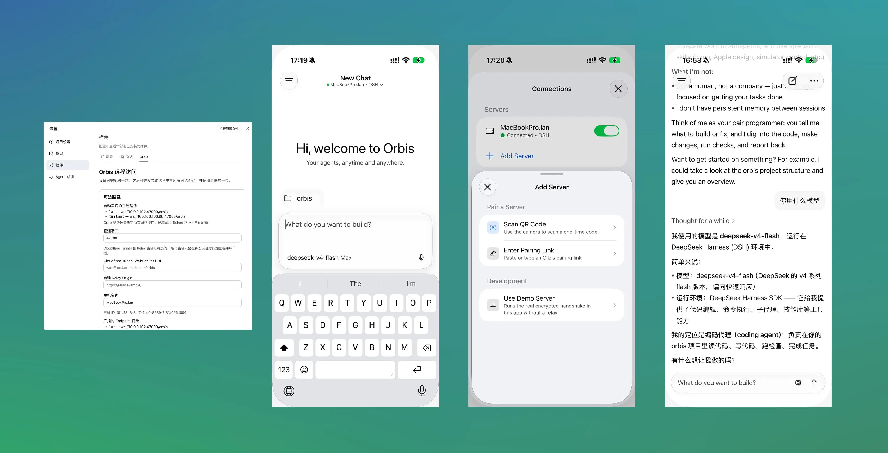

# Orbis

English | [简体中文](./README.zh.md)

Orbis is a remote control client for Deepseek Harness (DSH).

The Orbis plugin provides device pairing, end-to-end encrypted transport, and real-time
updates across multiple devices.



## Getting Started

1. Download the Orbis app. It is currently in beta. [Join Test](https://tally.so/r/A7RjzN)
2. Install the Orbis plugin into DSH.

```sh
dsh plugin --profile web add @orbis/remote-dsh  // available once published after the public beta
```

3. Configure the plugin and pair your device from the DSH web plugin page.

## Development

Install dependencies at the repository root, then use a single command to build the plugin,
install it into your local DSH Web profile, and start the test page:

```sh
pnpm install
ORBIS_DSH_HARNESS_DIR=/path/to/deepseek-harness pnpm run serve:dsh
```

The page is served at `http://127.0.0.1:3080` by default. Pass flags to change the port or
point at a specific test directory:

```sh
pnpm run serve:dsh --port 3090
pnpm run serve:dsh --workspace-root /path/to/workspace
pnpm run serve:dsh --help
```
